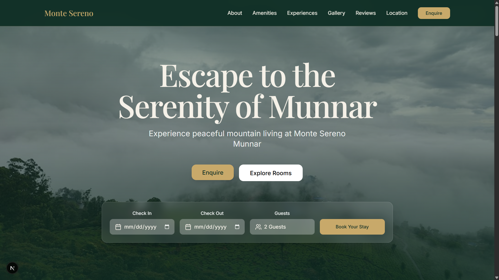
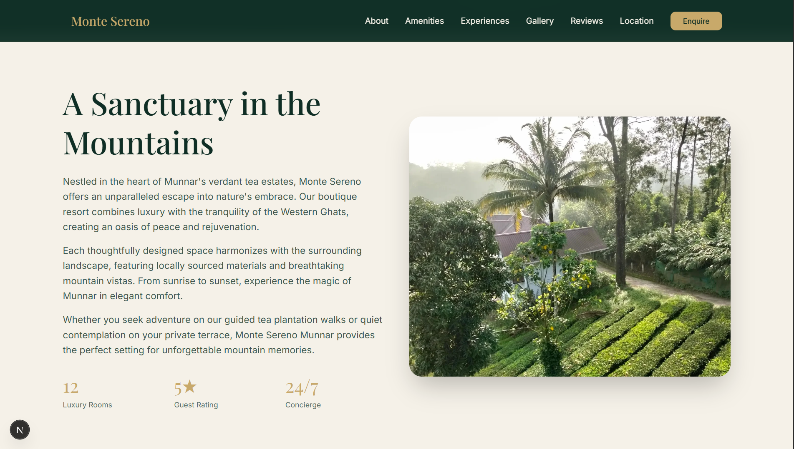

# Monte Sereno Munnar

A modern, responsive landing page for Monte Sereno, a luxury boutique resort nestled in the heart of Munnar's tea estates. Built with **Next.js 15**, **Tailwind CSS v4**, and **Framer Motion** for smooth, professional, Pinterest-style animations.

## Development

This project uses modern web standards and Next.js App Router for optimal performance and SEO.

### Prerequisites

Ensure you have Node.js and an appropriate package manager installed (`pnpm`, `npm`, or `yarn`).

### Getting Started

1. Install dependencies:
   ```bash
   npm install
   # or
   pnpm install
   # or
   yarn install
   ```

2. Run the development server:
   ```bash
   npm run dev
   # or
   pnpm dev
   # or
   yarn dev
   ```

3. Open [http://localhost:3000](http://localhost:3000) with your browser to see the result.

## Features

- **Next.js App Router**: Optimized build and file-system based routing.
- **Framer Motion**: Smooth, staggered entrance animations across the gallery, amenities, and content sections.
- **Direct Booking Integration**: Booking actions securely and directly open WhatsApp to coordinate reservations.
- **Fully Responsive**: Optimized for both mobile and desktop viewing experiences with an elegant luxury aesthetic.

## Previews

<div style="display: flex; flex-direction: column; gap: 20px;">
  
  
</div>